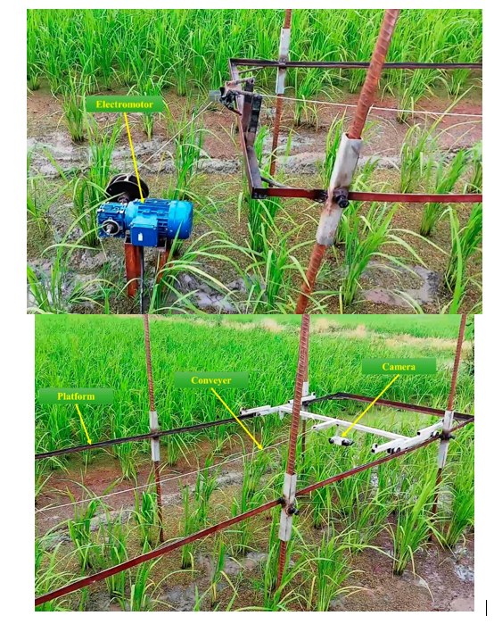
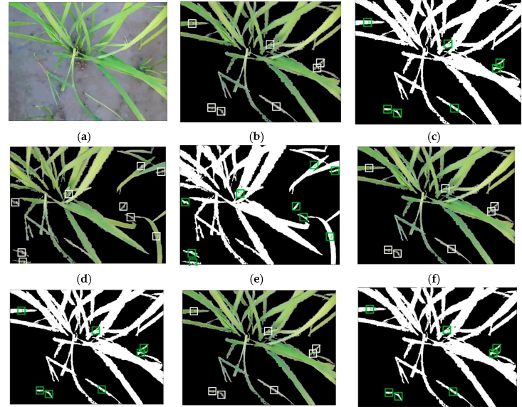

# 🌾 Real-Time Crop & Weed Detection Using YOLOV5

## 📌 Abstract

Site-specific weed management and selective application of herbicides as eco-friendly techniques are still challenging tasks—especially for densely cultivated crops like rice. This project aims to develop a real-time crop and weed detection system using a stereo vision camera setup and deep learning. It distinguishes between rice plants and weeds and classifies them using artificial neural networks optimized with metaheuristics (PSO and Bee Algorithm). It achieves **over 90% classification accuracy** on test sets, outperforming traditional classifiers like KNN.

## 🧪 Materials and Methods

- **Study Region:** 5-hectare rice field in Karimnagar, Telagana , India.
- **Crops:** Rice (Tarom Mahali)
- **Weeds:** Narrow-leaf (e.g., *Echinochloa crus-galli*), Broad-leaf (e.g., *Alisma plantago-aquatica*)
- **Camera:** Fujifilm FinePix Real 3D-W3 stereo camera
- **Processing:** FFmpeg, MATLAB, YOLOv5

The stereo camera was mounted on a rail platform moving at 0.10 m/s. Data was collected in stereo video format, converted into frames, segmented using RGB thresholds,
and analyzed for color, texture, and shape features.

## 🧠 Deep Learning & Feature Optimization

- **Total Features Used:** 302 (color, texture, shape)
- **Feature Selection Algorithms:** 
  - Particle Swarm Optimization (PSO)
  - Bee Algorithm (BA)
- **Classifier:** Artificial Neural Network (ANN)
- **Baseline Comparison:** K-Nearest Neighbors (KNN)
- **Best Accuracy:** 92.02% (ANN + BA, Geometric Mean)

## ⚙️ Tech Stack

| Component             | Technology        |
|----------------------|-------------------|
| Model Architecture    | YOLOv5            |
| Programming Language | Python            |
| Frameworks           | PyTorch, OpenCV   |
| Video Processing     | FFmpeg, MATLAB    |
| Deployment Platform  | Windows           |
| Hardware             | Stereo Camera, PC |
| Optimization         | PSO, Bee Algorithm|

---

## 🚀 How to Run the Project

1. **Clone the repo**
git clone https://github.com/SHYAMESH-KOMATLA/Crop-and-Weed-Detection-Using-Yolov5.git

Create a virtual environment (optional)
python -m venv venv
venv\Scripts\activate
Install dependencies
pip install -r requirements.txt
Run the detection (DroidCam/Webcam required)
python detect_live.py
Press Q to quit the camera window.
## Sample Images
## 📸 Detection Output

### Weed Detection Example:

### Crop & Weed Frame:

